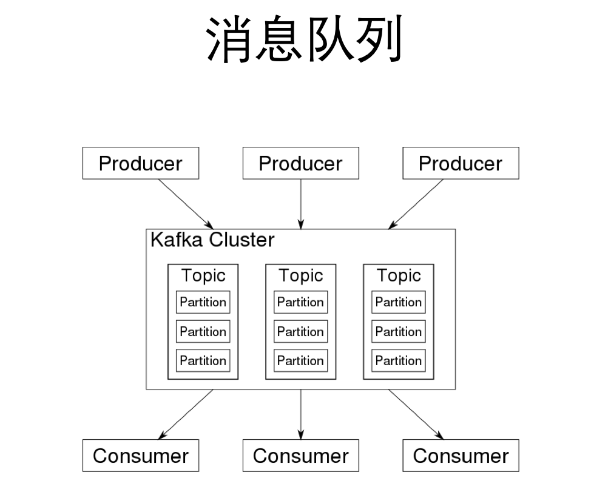

# JavaMQ
-------------

### 赛题介绍
题目: <实现进程内消息队列>  
开发语言:JAVA  
相关知识点: JAVA编程, 多线程, IO    
测评环境: 8核机器 16G内存   
以正确性, 运行效率为排名标准  

### 赛题背景

消息队列: 提供不同平台，不同语言的应用程序之间提供可靠的、持久的异步通讯机制
参与角色: Producer  Consumer
主要功能: 模块解耦, 数据缓冲区
常见消息队列: Kafka RabbitMQ ZeroMQ 
应用场景:  
双11订单、12306买票

### 图例

### 编程目标
实现简单的单进程消息队列
你的coding目标是实现以下接口:  
Producer的createBytesMessageToTopic(topic, body) 创建一个消息, 指定Topic  
Producer的send(message) 发送消息  
Producer的flush(), 发送结束时会调用一次  
Consumer的attachQueue(queue, topics) 为Queue绑定Topics  
Consumer的poll()  拉消息  

### 评测逻辑:
1 git clone下载代码  
2 push阶段: 四个线程同时push消息  
3 kill程序,清理页面缓存  
4 pull阶段: 四个线程同时pull消息  
5 以push和pull的总时间作为排名依据  
push和pull都有时间限制  

### 代码结构
#### pku包下面是你要用到的的类:
核心包括: Producer Consume KeyValue ByteMessage MessageHeader  
我们的评测程序只需要这5个类就能工作  
DefaultKeyValue和DefaultMessage是默认的key-value和message实现, 你完全可以自己自己的版本    
#### 此版本是一个内存实现的消息队列
为了方便大家理解题目, 为大家实现了一个内存存储的消息队列  
DemoConsumer: 继承Consumer  
DemoProducer: 继承Producer  
DemoMessageStore: 消息队列的内存存储实现  
DemoTester: 一个测评程序, 里面会开启多个线程进行push与pull, 通过这个类你可以了解到测评程序的运行逻辑    

